# Navigation Redesign Proposal

## Purpose
Design a modern, scalable SaaS/ERP navigation model for Retail POS that:
- Reduces cognitive load
- Improves speed to task
- Supports role-based visibility
- Scales cleanly to 100+ screens
- Aligns with patterns used in Shopify, Odoo, Zoho Inventory, and modern POS suites

This document is a pre-implementation architecture proposal only.

## Current Navigation Pain Points
1. Main business modules are split between top navigation and sidebar context, creating context switching.
2. Sidebar depends on selecting top menu parent first, which adds an extra step.
3. Horizontal menu does not scale well as modules/screens increase.
4. Active state hierarchy is not explicit enough for deeper module trees.
5. Future expansion (new modules and sub-features) risks overcrowding current IA.

## Target UX Principles
1. One primary navigation rail: all business modules in a left sidebar.
2. Top bar reserved for utilities only.
3. Information architecture based on business workflows, not technical domains.
4. Progressive disclosure:
- Expanded sidebar shows section headers and labels.
- Collapsed sidebar shows icons with tooltips.
5. Clear active state:
- Left accent border
- Subtle active background
- Stronger text contrast
6. Consistent iconography:
- 20 to 22 px icon scale for primary items
- 18 px for nested items
7. Scalable structure:
- Section-based grouping
- Optional nested children
- Permission-aware rendering per item

## Proposed Navigation Information Architecture

### Sidebar Sections and Items

CATALOG
- Products
- Categories
- Brands
- Variations

INVENTORY
- Inventory
- Stock Adjustment
- Stock Transfer
- Low Stock Alerts

PROCUREMENT
- Purchase Orders
- Goods Received Notes (GRN)
- Suppliers

SALES
- POS Sales
- Sales Orders
- Customers

FINANCE
- Accounting
- Payments

REPORTING
- Reports
- Dashboard

ADMINISTRATION
- Users
- Roles
- Settings

## Top Bar Scope (Utility-Only)
The top bar will contain only:
- Global Search
- Notifications
- Outlet Switcher
- User Profile

All business modules are removed from top bar navigation.

## Menu Hierarchy Diagram

```mermaid
flowchart TD
  A[Application Shell]
  A --> B[Top Bar Utilities]
  A --> C[Collapsible Sidebar]

  B --> B1[Global Search]
  B --> B2[Notifications]
  B --> B3[Outlet Switcher]
  B --> B4[User Profile]

  C --> G1[CATALOG]
  C --> G2[INVENTORY]
  C --> G3[PROCUREMENT]
  C --> G4[SALES]
  C --> G5[FINANCE]
  C --> G6[REPORTING]
  C --> G7[ADMINISTRATION]

  G1 --> G1A[Products]
  G1 --> G1B[Categories]
  G1 --> G1C[Brands]
  G1 --> G1D[Variations]

  G2 --> G2A[Inventory]
  G2 --> G2B[Stock Adjustment]
  G2 --> G2C[Stock Transfer]
  G2 --> G2D[Low Stock Alerts]

  G3 --> G3A[Purchase Orders]
  G3 --> G3B[GRN]
  G3 --> G3C[Suppliers]

  G4 --> G4A[POS Sales]
  G4 --> G4B[Sales Orders]
  G4 --> G4C[Customers]

  G5 --> G5A[Accounting]
  G5 --> G5B[Payments]

  G6 --> G6A[Reports]
  G6 --> G6B[Dashboard]

  G7 --> G7A[Users]
  G7 --> G7B[Roles]
  G7 --> G7C[Settings]
```

## Interaction Model

### Sidebar Modes
1. Expanded mode (default desktop)
- Section header + menu label + icon
- Nested groups can optionally support accordion behavior

2. Collapsed mode
- Icon-only rail
- Tooltip on hover
- Active indicator remains visible

3. Mobile mode
- Off-canvas drawer
- Utility top bar remains fixed
- Overlay close on outside click

### Active State Rules
1. Current leaf route receives active style:
- Left border accent (2 to 3 px)
- Soft accent background
- Semibold label
2. Parent section remains highlighted when child route is active.
3. Breadcrumb-capable route metadata should preserve parent-child relation for deep screens.

## Visual and Typography Guidance
1. Sidebar width:
- Expanded: 260 to 280 px
- Collapsed: 72 to 80 px
2. Icon size:
- Primary item: 20 to 22 px
- Secondary item: 18 px
3. Typography:
- Section headers: 11 to 12 px, uppercase, medium tracking
- Item labels: 14 px medium
- Utility actions: 13 to 14 px
4. Spacing:
- Group spacing: 16 to 24 px between sections
- Item vertical rhythm: 8 to 10 px

## Data Model and Scalability Architecture
To support 100+ future screens, menu configuration should evolve from a flat parent/child list to section-first schema.

Proposed conceptual schema:
- NavSection
  - id
  - label
  - order
  - items[]
- NavItem
  - id
  - label
  - icon
  - route
  - permission or permissions[]
  - children[] optional
  - badgeProvider optional
  - featureFlag optional

Scalability controls:
1. Lazy badge resolution for counts (for example low stock, pending approvals).
2. Permission filtering at build-time and runtime.
3. Feature flags for staged rollout of future modules.
4. Route metadata for breadcrumb, active parent, and analytics tagging.

## Mapping from Current to Proposed Groups

Current menus map into the new sections as follows:
- Dashboard and Reports become REPORTING (Dashboard, Reports)
- Products and Master Data entries are redistributed into CATALOG and PROCUREMENT
- Stock Movement and Inventory move under INVENTORY
- Procurement stays under PROCUREMENT with GRN and Suppliers
- Sales remains under SALES
- Accounting remains under FINANCE
- Administration remains under ADMINISTRATION

## Implementation Strategy (Phased)

### Phase 1: Navigation Schema Refactor
- Introduce section-based navigation model
- Keep permission filtering compatible with existing auth service

### Phase 2: Sidebar UI Refactor
- Replace context-dependent child-only sidebar with full grouped sidebar
- Add expanded/collapsed modes and active-state enhancements

### Phase 3: Top Bar Simplification
- Remove business module nav from top bar
- Keep only utility actions

### Phase 4: Route and Behavior Hardening
- Verify active-state mapping for all routes
- Add tooltips and keyboard navigation
- Validate mobile drawer behavior

### Phase 5: Quality and Adoption
- Regression test role-based visibility
- Validate on tablet/desktop/mobile breakpoints
- Track click depth and navigation success metrics

## Acceptance Criteria
1. Sidebar displays all business modules grouped by section.
2. Sidebar supports expanded and collapsed modes.
3. Top bar shows utilities only.
4. Active item style includes accent border, subtle background, and contrast improvement.
5. Section headers and spacing are visible and consistent.
6. Icons are 20 px or larger on primary navigation items.
7. Navigation remains permission-aware.
8. Architecture supports straightforward expansion to 100+ screens.

## Notes for Implementation Readiness
1. Existing MenuService can be extended rather than replaced.
2. Current permission model can be reused with section-first menu schema.
3. Existing layout shell with navbar and sidebar can be retained while replacing internals.
4. Route definitions can remain unchanged; only nav configuration and rendering logic need migration.
